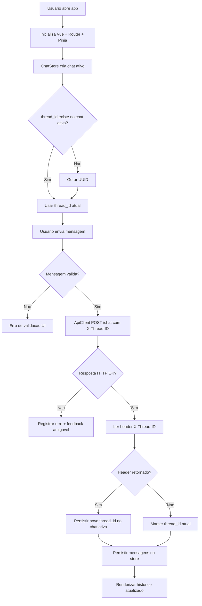

# Plano de Implementação - Frontend Chat POC banking-llm

Output-Format: MD

**Data**: 07/06/2026  
**Última Revisão**: 07/06/2026  
**Versão**: 1.0  
**Baseado em**: tasks/specs/20260607-banking-frontend-chat-poc-spec.md  
**Risco**: 🟡 MÉDIA  
**Risco Rollback**: 🟢 BAIXA

**Changelog v1.0**:

- Versão inicial
- Planejamento técnico para bootstrap completo do projeto em modo first-commit big bang

---

## 1. Análise de Alternativas

| Abordagem                                                  | Prós                                                                                                                                          | Contras                                                                                  |
| ---------------------------------------------------------- | --------------------------------------------------------------------------------------------------------------------------------------------- | ---------------------------------------------------------------------------------------- |
| Opção A: SPA Vue 3 + Pinia + Axios + Playwright            | Aderência total ao contexto global, baixo atrito com stack já definida, implementação direta do fluxo X-Thread-ID, fácil evolução incremental | Exige setup inicial maior no primeiro commit (lint, testes, estrutura)                   |
| Opção B: SPA Vue 3 sem Pinia (estado local por componente) | Menor volume inicial de código                                                                                                                | Perde padrão arquitetural definido (Store Pattern), reduz escalabilidade e testabilidade |
| Fazer nada                                                 | Zero esforço imediato                                                                                                                         | Bloqueia validação da POC e não atende requisitos aprovados                              |

Escolhida: Opção A | Justificativa: é a única opção com conformidade total aos padrões de projeto e aos requisitos críticos de persistência do X-Thread-ID por chat ativo.

## 2. Design da Solução (Mermaid)

## 3. Roteiro de Desenvolvimento

[TASK-01] Bootstrap do projeto frontend e toolchain [risco: 🟡] [risco rollback: 🟢]  
Objetivo: criar a base executável do app com Vite, Vue 3, Tailwind dark-only, lint/format e estrutura de diretórios aderente ao contexto.  
Arquivos:

- package.json (criar)
- vite.config.js (criar)
- index.html (criar)
- src/main.js (criar)
- src/App.vue (criar)
- src/style.css (criar)
- tailwind.config.js (criar)
- postcss.config.js (criar)
- .eslintrc.\* (criar)
- .prettierrc\* (criar)
- .gitignore (criar)
  Passos:

1. Inicializar projeto com Vite + Vue.
2. Configurar Tailwind em modo dark-only e tokens de paleta (#41436A, #984063, #F64668, #FE9677).
3. Configurar aliases e variáveis de ambiente para URL do backend.
4. Configurar lint e format para garantir qualidade base.
   Critérios de Aceitação:

- [x] Código implementado conforme design
- [x] Linting e formatter sem erros ou warnings
- [x] Build passa sem erros ou warnings
- [x] Rollback definido
      Rollback:
- Remover arquivos de bootstrap e restaurar estado anterior do repositório.

[TASK-02] Camada de integração HTTP e contrato de chat [risco: 🟡] [risco rollback: 🟢]  
Objetivo: implementar Service Layer com cliente HTTP centralizado para POST /chat e tratamento de headers de thread.  
Arquivos:

- src/api/http.js (criar)
- src/api/chat.service.js (criar)
- src/config/env.js (criar)
- src/utils/thread-id.js (criar)
  Passos:

1. Criar instância Axios com baseURL configurável por ambiente.
2. Implementar método sendMessage(question, threadId).
3. Capturar X-Thread-ID da resposta e retornar ao chamador junto do payload.
4. Padronizar tratamento de erro técnico (status, mensagem e metadados mínimos).
   Critérios de Aceitação:

- [x] Código implementado conforme design
- [x] Testes unitários escritos para a camada api
- [x] Build passa sem erros ou warnings
- [x] Rollback definido
      Rollback:
- Remover camada api nova e fallback para chamada mock local sem integração externa.

[TASK-03] Estado conversacional com persistência de thread por chat ativo [risco: 🔴] [risco rollback: 🟡]  
Objetivo: implementar Store Pattern com gerenciamento de conversas, mensagens e persistência do X-Thread-ID retornado pelo backend.  
Arquivos:

- src/stores/chat.store.js (criar)
- src/composables/useChatSession.js (criar)
- src/utils/uuid.js (criar)
  Passos:

1. Definir modelo de estado para chat ativo, lista de mensagens e thread_id.
2. Garantir geração de UUID ao novo chat.
3. Na ação de envio: mandar X-Thread-ID atual, receber header de resposta e persistir no chat ativo.
4. Garantir invariante: sem thread_id válido não há envio.
   Critérios de Aceitação:

- [x] Código implementado conforme design
- [x] Testes unitários para regras críticas do store
- [x] Invariante de thread validada por testes
- [x] Rollback definido
      Rollback:
- Reverter store para estado mínimo sem persistência entre iterações e desabilitar atualização por header.

[TASK-04] UI de chat dark-only com paleta da POC [risco: 🟡] [risco rollback: 🟢]  
Objetivo: entregar interface funcional de chat com UX de envio, loading, erro e histórico, usando exclusivamente tema escuro.  
Arquivos:

- src/views/ChatView.vue (criar)
- src/components/chat/ChatLayout.vue (criar)
- src/components/chat/MessageList.vue (criar)
- src/components/chat/MessageInput.vue (criar)
- src/components/chat/ChatHeader.vue (criar)
- src/router/index.js (criar)
  Passos:

1. Construir layout principal com foco em conversa única.
2. Integrar componentes ao chat.store.
3. Aplicar tokens de cor e contraste AA mínimo.
4. Exibir estados de validação, carregamento e erro amigável.
   Critérios de Aceitação:

- [x] Código implementado conforme design
- [x] Build e lint sem erros ou warnings
- [x] Jornada principal validada manualmente
- [x] Rollback definido
      Rollback:
- Reverter para página placeholder mantendo apenas infraestrutura base.

[TASK-05] Qualidade: testes unitários e E2E Playwright [risco: 🟡] [risco rollback: 🟢]  
Objetivo: garantir cobertura dos fluxos críticos aprovados na spec (sucesso, erro, invariante de thread).  
Arquivos:

- vitest.config.js (criar)
- src/stores/chat.store.spec.js (criar)
- src/api/chat.service.spec.js (criar)
- playwright.config.js (criar)
- tests/e2e/chat-happy-path.spec.js (criar)
- tests/e2e/chat-thread-header.spec.js (criar)
- tests/e2e/chat-error.spec.js (criar)
  Passos:

1. Configurar Vitest + Vue Test Utils.
2. Criar testes unitários de store e service para persistência de X-Thread-ID.
3. Configurar Playwright e criar testes E2E integrados com backend de teste ou mock HTTP.
4. Incluir scripts npm para test, test:unit, test:e2e.
   Critérios de Aceitação:

- [x] Testes unitários e E2E escritos
- [x] Execução local dos testes sem falha
- [x] Rollback definido
      Rollback:
- Manter apenas testes unitários essenciais e retirar suíte E2E temporariamente se ambiente de execução bloquear entrega.

[TASK-06] Documentação operacional e handoff [risco: 🟢] [risco rollback: 🟢]  
Objetivo: documentar setup, execução e contrato do fluxo de thread para facilitar onboarding e manutenção.  
Arquivos:

- README.md (criar)
- docs/adr/01-project-spec.md (alterar se necessário, somente se houver divergência final)
  Passos:

1. Documentar setup local e scripts.
2. Documentar fluxo X-Thread-ID (request e response).
3. Descrever limitações da POC (sem auth) e próximos passos.
   Critérios de Aceitação:

- [x] Documentação atualizada
- [x] Rollback definido
      Rollback:
- Reverter seções adicionadas no README mantendo apenas instruções mínimas de execução.

## 4. Dependências e Ordem de Execução

1. TASK-01 bloqueia todas as demais.
2. TASK-02 depende de TASK-01.
3. TASK-03 depende de TASK-02.
4. TASK-04 depende de TASK-03.
5. TASK-05 depende de TASK-02, TASK-03 e TASK-04.
6. TASK-06 pode ocorrer ao final, após TASK-05.

## 5. Sequência de Commits

Como este é o primeiro commit do projeto e foi solicitado modo big bang, a estratégia padrão será:

1. Commit único (big bang): bootstrap + integração + store + UI + testes + documentação.

Sugestão de mensagem de commit:

- feat(frontend): bootstrap chat poc banking-llm with thread header persistence and tests

Estratégia alternativa (se necessário quebrar por risco técnico durante execução):

1. chore(frontend): bootstrap project and toolchain
2. feat(chat): implement api, store and thread id persistence
3. test(chat): add unit and playwright e2e coverage
4. docs(frontend): add setup and thread flow documentation

## 6. Verificação

- [x] Domínio isolado de infraestrutura
- [x] Nenhum modelo anêmico
- [x] Build, linting e formatter sem erros ou warnings
- [x] Cobertura de teste adequada para regras críticas
- [x] Código morto ou não utilizado removido
- [x] Comentários desnecessários removidos
- [x] Dependências mapeadas (o que bloqueia o quê)
- [x] Rollback definido por task
- [x] Ordem de commits não quebra build

## 7. Transição

Implementação concluída conforme plano, com lint, build, testes unitários e testes E2E validados.
Próxima etapa: revisão de código e decisão de merge do primeiro commit big bang.
