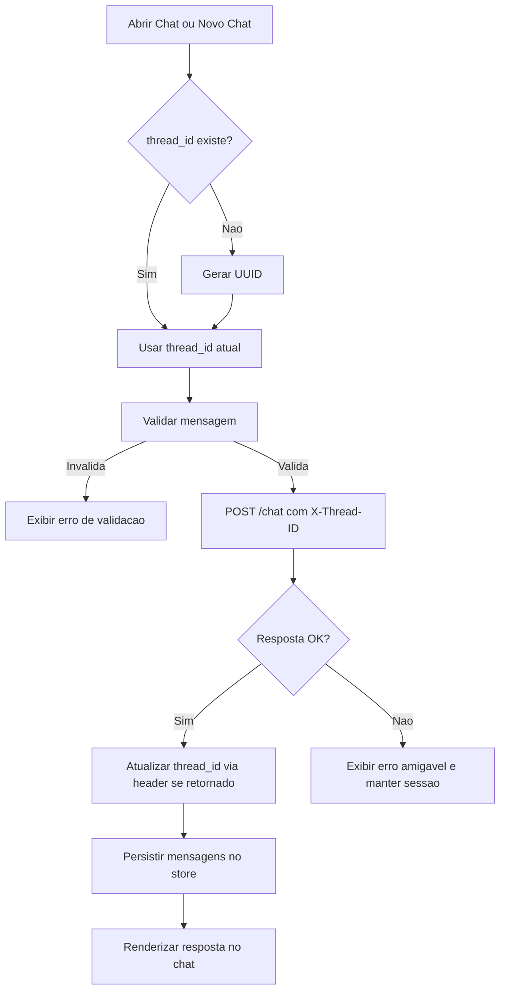

# Frontend Chat POC para banking-llm

**Data**: 07/06/2026  
**Última Revisão**: 07/06/2026  
**Versão**: 1.0  
**Solicitante**: Definição inicial da POC de frontend para integração com backend banking-llm  
**Prioridade**: 🔴 ALTA

**Changelog v1.0**:

- Versão inicial
- Baseada no contexto global em docs/adr/01-project-spec.md

---

## Objetivo (Why)

Entregar um frontend web enxuto que funcione como canal conversacional com o backend banking-llm, permitindo o envio de perguntas e exibição de respostas em fluxo de chat. A solução prioriza velocidade de implementação, previsibilidade técnica e clareza de UX para validação da proposta de valor da POC.

Nesta primeira iteração, login e autenticação ficam fora do escopo para reduzir complexidade e acelerar feedback. Como o backend depende de contexto conversacional por thread, o frontend deve garantir o envio e sincronização do identificador de conversa via header X-Thread-ID em todas as interações do chat ativo.

## Escopo e Fronteiras

### In-Scope

- Criar projeto frontend SPA em Vue 3 com Vite.
- Implementar tela única de chat (histórico, input e envio de mensagem).
- Integrar com endpoint POST /chat do backend banking-llm.
- Gerar thread_id (UUID) ao iniciar novo chat.
- Enviar X-Thread-ID no header de cada requisição do chat ativo.
- Atualizar/sincronizar thread_id a partir do header X-Thread-ID retornado pela API.
- Persistir o thread_id retornado no estado local do chat ativo para uso nas próximas iterações da mesma conversa.
- Aplicar tema exclusivamente escuro com paleta definida.
- Configurar base de testes unitários e testes E2E com Playwright.

### Out-of-Scope

- Login, autenticação, autorização e gestão de sessão autenticada.
- Cadastro de usuário, recuperação de senha, perfis e permissões.
- Múltiplos canais de atendimento além do chat web.
- Painel administrativo e analytics avançado.
- Internacionalização multilíngue.

### Decisões Prévias

- Arquitetura SPA com separação em camadas: api, stores, views, components.
- Integração principal com backend via HTTP no endpoint POST /chat.
- Tema visual apenas dark mode para toda a POC.
- Paleta base obrigatória da POC:
  - #41436A
  - #984063
  - #F64668
  - #FE9677

## Descrição Funcional (What)

O usuário acessa a aplicação e visualiza imediatamente a tela de chat em tema escuro. Ao iniciar uma nova conversa, o sistema cria um thread_id único, mantém esse identificador no estado da sessão de chat e o envia no header X-Thread-ID a cada mensagem enviada ao backend.

Cada resposta retornada pelo backend é exibida no histórico da conversa. Se o backend devolver X-Thread-ID no response header, o frontend deve atualizar e persistir esse valor no estado local do chat ativo para manter continuidade entre interações subsequentes da mesma conversa. Erros de comunicação devem ser mostrados de forma amigável sem quebrar a sessão de uso.

## Fluxo Técnico

Gatilho → Validação → Processamento → Persistência → Resposta

- Gatilho:
  - Usuário abre a aplicação ou clica em Novo Chat.
  - Usuário digita mensagem e aciona Enviar.
- Validação:
  - Verificar mensagem não vazia (trim).
  - Verificar existência de thread_id para chat ativo; se ausente, gerar UUID.
- Processamento:
  - Montar payload { question } para POST /chat.
  - Injetar header X-Thread-ID com thread_id atual.
- Persistência:
  - Persistir no estado local (Pinia) mensagens de usuário e assistente.
  - Persistir thread_id por chat ativo no store local e atualizar com valor retornado no header, se houver.
- Resposta:
  - Renderizar resposta textual do backend no histórico.
  - Em caso de erro HTTP/rede, exibir feedback amigável e manter chat utilizável.

## Critérios de Aceitação (Gherkin)

Feature: Chat POC banking-llm | Esforço: Médio | Risco: Médio

Scenario: Sucesso - enviar mensagem com continuidade de contexto
Given que o usuário está na tela de chat e possui um chat ativo
When ele envia uma mensagem válida
Then o frontend envia POST /chat com header X-Thread-ID
And exibe a resposta do backend no histórico
And mantém o thread_id para as próximas mensagens do mesmo chat

Scenario: Sucesso - backend retorna novo X-Thread-ID
Given que o usuário enviou uma mensagem em um chat ativo
When a resposta HTTP retorna o header X-Thread-ID
Then o frontend persiste o novo thread_id no estado local do chat ativo
And a próxima mensagem do mesmo chat reutiliza esse thread_id persistido

Scenario: Sucesso - iniciar novo chat com novo contexto
Given que existe um chat com thread_id previamente utilizado
When o usuário inicia um novo chat
Then o frontend gera um novo UUID para thread_id
And as próximas mensagens usam apenas o novo X-Thread-ID
And o contexto da conversa anterior não é reutilizado

Scenario: Erro - backend indisponível
Given que o backend está indisponível ou retorna erro 5xx
When o usuário envia uma mensagem
Then o frontend exibe uma mensagem de erro amigável
And registra o erro técnico para diagnóstico
And permite nova tentativa sem recarregar a página

Scenario: Erro - payload inválido
Given que o campo de mensagem está vazio ou contém apenas espaços
When o usuário tenta enviar
Then a requisição não é disparada
And o usuário recebe indicação visual de validação

Scenario: Invariante - cabeçalho obrigatório por conversa ativa
Given que existe um chat ativo
When qualquer requisição de mensagem é enviada
Then o header X-Thread-ID deve sempre estar presente
And o sistema impede envio sem thread_id válido

## Considerações Técnicas

- Endpoints/Events:
  - POST /chat
- Banco:
  - Não aplicável no frontend.
- Cache/Queue:
  - Não aplicável nesta fase.
- Segurança:
  - Sem autenticação nesta POC por decisão de escopo.
  - Sanitização básica de entrada no cliente (trim e limite mínimo/máximo definido na implementação).
  - Nenhum segredo embutido no código.
- Performance:
  - Tempo de resposta percebido para feedback visual inicial < 150ms após submit (estado de loading).
  - Interface deve manter fluidez com histórico de até 200 mensagens sem travamento perceptível.
- Observabilidade:
  - Logs de erro no cliente com contexto mínimo (endpoint, status, timestamp).
  - Estrutura preparada para futura integração com monitoramento frontend.
- UI/Theme:
  - Exclusivamente dark mode.
  - Tokens de cor obrigatórios baseados na paleta:
    - color-base-1: #41436A
    - color-base-2: #984063
    - color-accent-1: #F64668
    - color-accent-2: #FE9677
  - Contraste mínimo AA para texto e elementos interativos.

## Conformidade com Padrões de Design

| Padrão existente   | Aplicável? | Conformidade | Observação                                                                 |
| ------------------ | ---------- | ------------ | -------------------------------------------------------------------------- |
| Service Layer      | Sim        | Total        | Cliente HTTP centralizado em camada api para chamadas ao backend.          |
| Store Pattern      | Sim        | Total        | Estado de chat, mensagens e thread_id concentrado no store.                |
| Component-Based UI | Sim        | Total        | Tela e blocos de chat separados em componentes reutilizáveis.              |
| Router             | Sim        | Parcial      | Aplicação pode iniciar com rota única; estrutura preparada para evolução.  |
| Factory (simples)  | Sim        | Total        | Instanciação do cliente HTTP configurado (baseURL, interceptors, headers). |
| Adapter            | Sim        | Total        | Mapeamento explícito de request/response entre UI e contrato /chat.        |

### Refatoração Necessária

- Não há refatoração mandatória no contexto atual para iniciar a POC.
- Caso surja necessidade de múltiplos tipos de sessão (ex: streaming, anexos, multimodal), planejar extração de adapter dedicado para contrato de chat.

### Impacto no contexto global

- Não exige atualização imediata de docs/adr/01-project-spec.md.
- Se a POC evoluir para autenticação ou múltiplos canais, atualizar contexto global com novos padrões e restrições.

## Diagrama (Mermaid)

## DoD

- [ ] Código lintado
- [ ] Testes unitários para store e camada de api
- [ ] Testes E2E com Playwright cobrindo fluxo feliz e erro
- [ ] Documentação de setup e execução local atualizada
- [ ] Validação visual em tema escuro aplicada em toda a jornada principal

## Verificação

- [ ] Requisito validado com stakeholder
- [ ] Impacto em contratos existentes mapeado
- [ ] Estimativa consensuada
- [ ] Sem [Consulta Necessária] ou [Suposição] não validada

## Transição de Estado

A SPEC só é considerada DONE quando o usuário aprovar explicitamente este documento.

Próximo passo: invocar @plan com o comando /plan tasks/specs/20260607-banking-frontend-chat-poc-spec.md.
